# `Projeto`
Teste técnico SHARENERGY

# `Vídeo explicativo`
[https://youtu.be/QZOpOgpzwOk](https://youtu.be/QZOpOgpzwOk).  

# `Instalando e rodando localmente`
1. Fazer o clone do projeto. 
2. Dento da pasta *backend* rodar npm install. 
3. Dento da pasta *backend* rodar npm run dev o servidor ficará escutando na porta 3003. 
4. Dento da pasta *frontend* rodar npm install. 
5. Dento da pasta *frontend* rodar npm run start e a página abrirá na porta 3000.

# `Descrição`
Este projeto foi desenvolvido como parte do processo de seleção da empresa Sharenergy. Foram desenvolvidos tanto o *fronted* quanto *backend*. A API possui 13 (treze) endpoints e sua documentação pode ser acessada no link abaixo:  

[https://documenter.getpostman.com/view/21552787/2s8Z76uTyh](https://documenter.getpostman.com/view/21552787/2s8Z76uTyh).  

Para navegar pela aplicação é necessário realizar um cadastro. Existem dois tipos de usuários: NORMAL e ADMIN, que possuem acessos a diferentes opções, como mostra o esquema abaixo:

|        | Pessoas            | Gatos              | Cachorros          | Meu Perfil         | Usuários | Clientes|
|--------|--------------------|--------------------|--------------------|--------------------|----------|---------|
| NORMAL | :white_check_mark: | :white_check_mark: | :white_check_mark: | :white_check_mark: | :x:      | :x:
| ADMIN  | :white_check_mark: | :white_check_mark: | :white_check_mark: | :white_check_mark: | :white_check_mark: | :white_check_mark:  

# `Páginas da aplicação`
A aplicação é composta, no total, por nove páginas diferentes: apresentação, sobre, login, pessoas, gatos, cachorros, meu perfil, usuários e clientes:

**Página Apresentação:** página inicial para a qual o usuário é direcionado inicialmente, composta por um texto de boas vindas.

**Página Sobre:** composta por um pequeno resumo sobre o projeto.

**Página Login:** página onde o usuário insere seus dados para fazer login. É possível salvar seus dados para manter-se logado selecionando "Lembrar-me".

**Página Pessoas:** nesta página existem alguns componentes:
- cabeçalho: onde o usuário pode navegar entre as páginas da aplicação e também uma opção de logout.  
- filtro: na parte esquerda central existem algumas opções de filtro e ordenação das pessoas que aparecem na parte principal da página.  
- lista de pessoas: na parte central são exibidos cards das pessoas, onde estão contidas (além da foto) as informações de: username, nome, idade e e-mail.  
- rodapé: exibido na parte inferior, contém algumas informações da Sharenergy e também ícones que direcionam para as redes sociais da empresa.

**Página Gatos:** nesta página, o usuário pode escolher um status http e então lhe é retornado uma imagem correspondente ao status selecionado.

**Página Cachorros:** nesta página, o usuário pode iteragir com o botão "Atualizar", então é mostrada uma nova imagem (ou vídeo) de um cachorro.

**Página Meu Perfil:** nesta página o usuário pode completar o seu cadastro e editar seus dados.

**Página Usuários:** disponível apenas para usuários do tipo ADMIN. Nesta página é possível ver todos os usuários que estão cadastrados no sistema, detalhar as informações, editar o tipo e deletar.

**Página Clientes:** disponível apenas para usuários do tipo ADMIN. Nesta página é possível manipular informações de clientes: criar, detalhar, editar e deletar.

# `Testes`
Foram feitos testes unitários utilizando Jest:
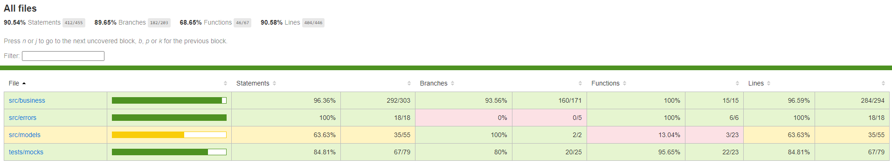

# `Tecnologias utilizadas`

# `Autor`
Evandro Paulo Folletto  
 
 

# `Paleta de cores utilizada`
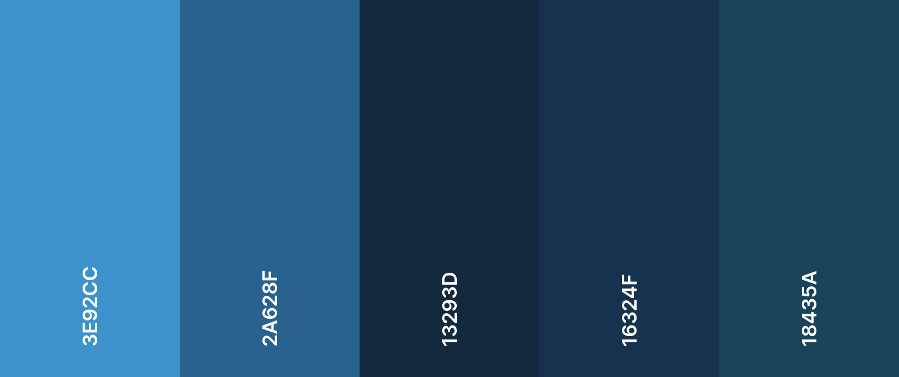

# `Imagens`

### Página Start
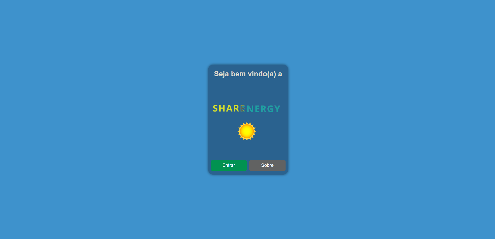

### Página About
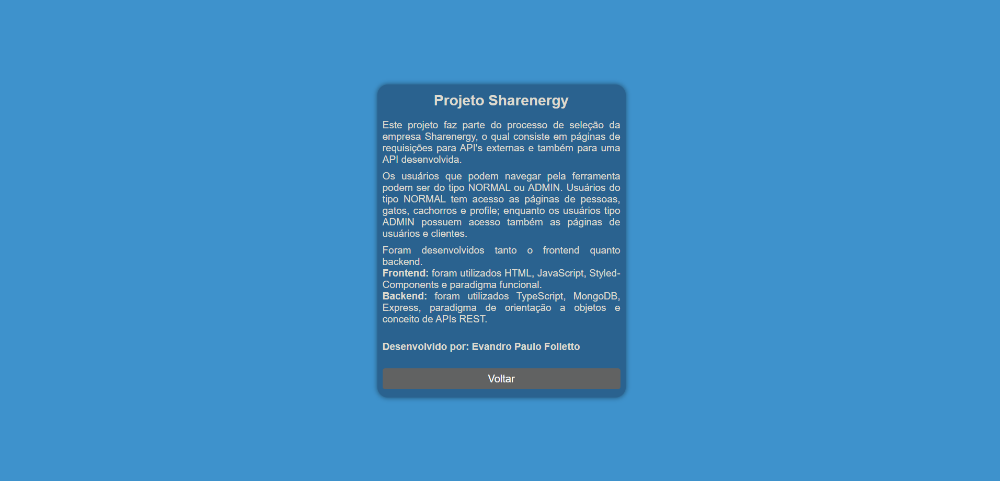

### Página Pessoas
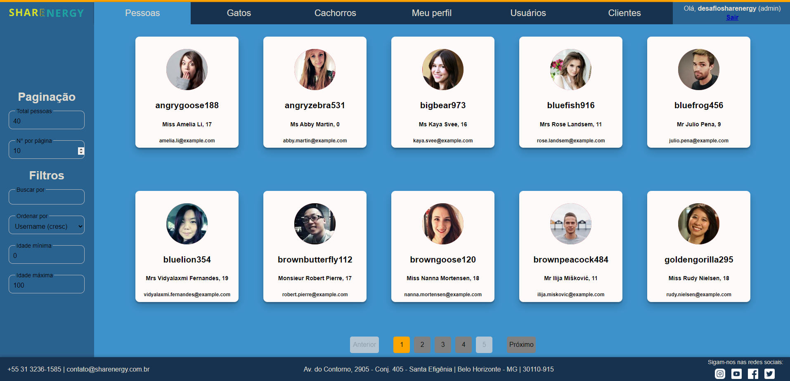

### Página Gatos
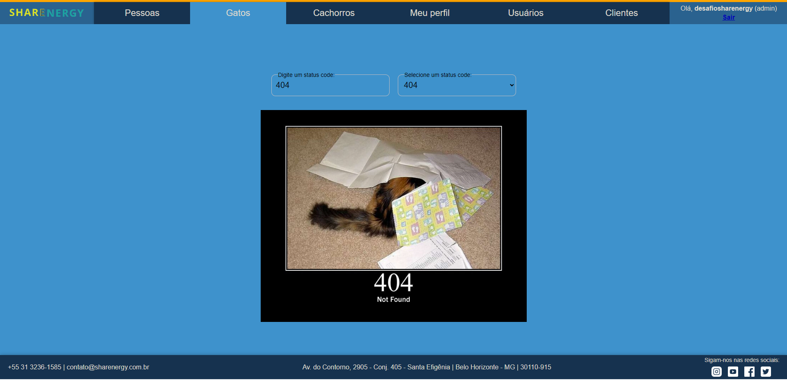

### Página Cachorros
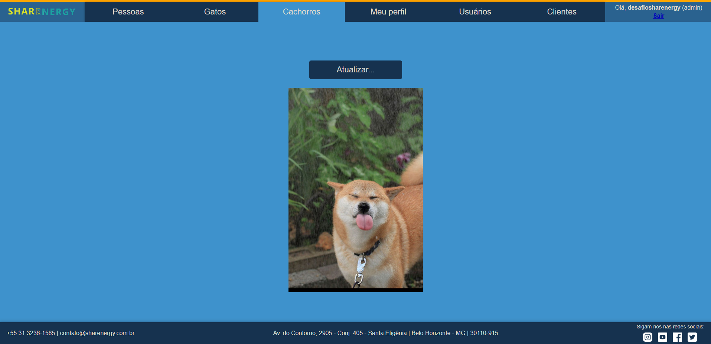

### Página Meu Perfil
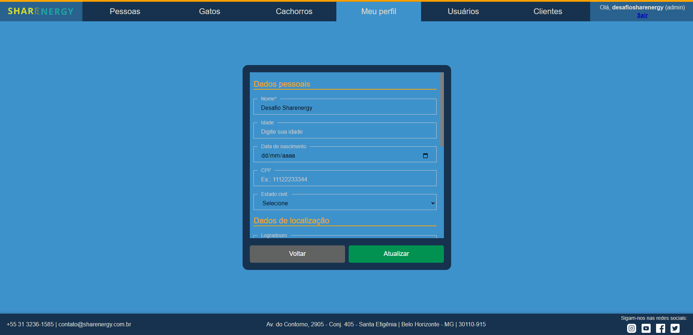

### Página Usuários
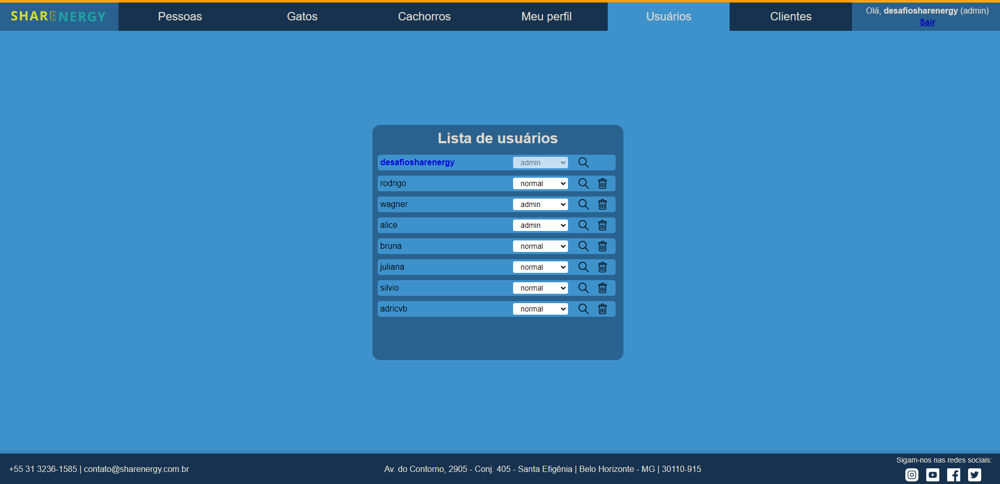

### Página Cliente

### Página Cliente
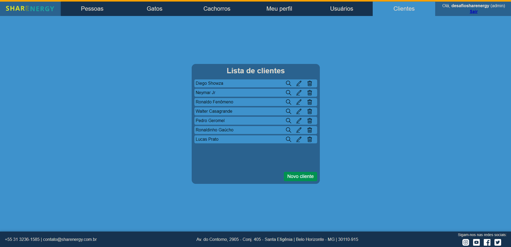

### Página Cliente
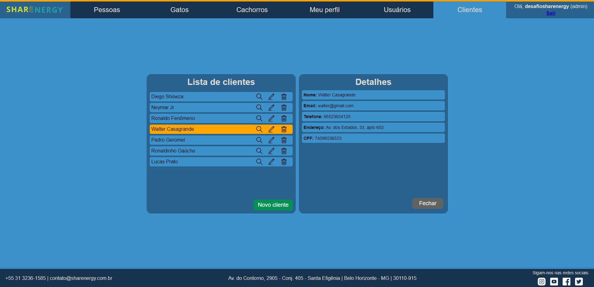

### Página Cliente
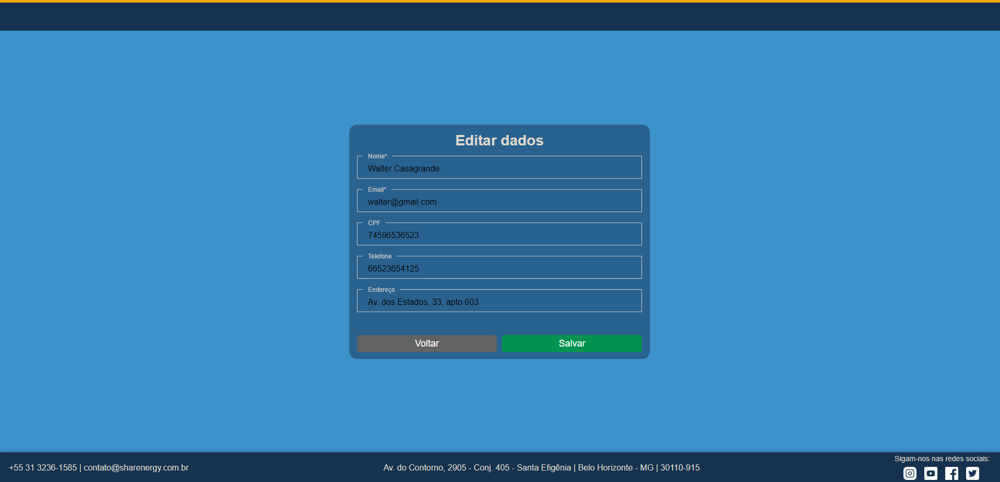

### Página Detail
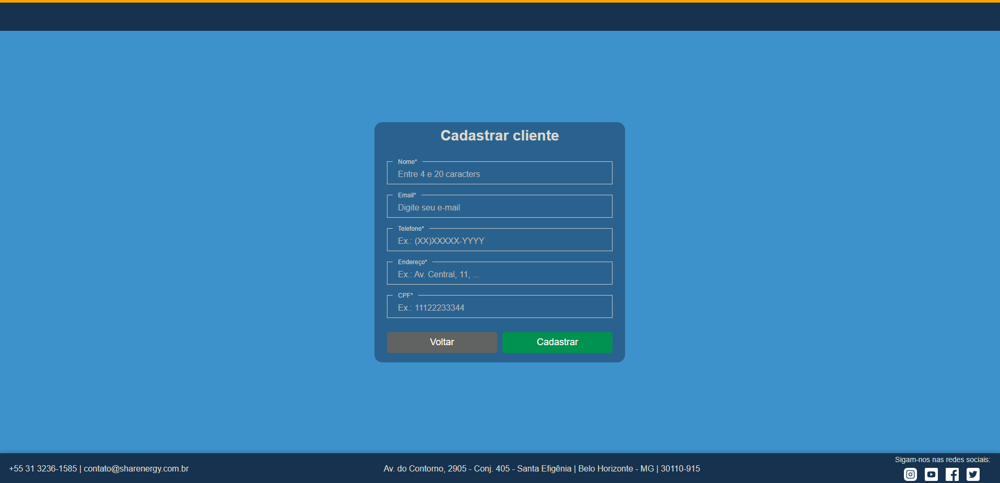